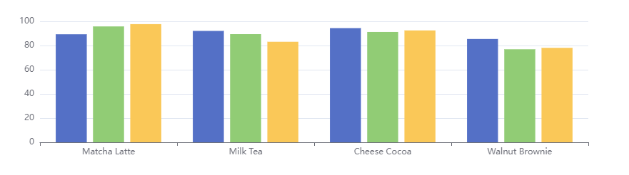
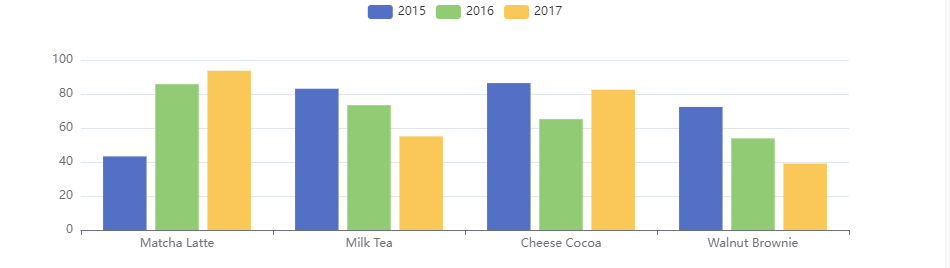
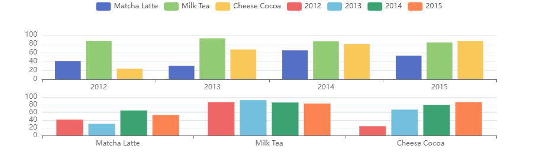

# 数据集

##  1. 在系列中设置数据

将数据设置在 ==系列(series)== 中，例如：

```javascript
option = {
    xAxis: {
        type: 'category',
        data: ['Matcha Latte', 'Milk Tea', 'Cheese Cocoa', 'Walnut Brownie']
    },
    yAxis: {},
    series: [
        {
            type: 'bar',
            name: '2015',
            data: [89.3, 92.1, 94.4, 85.4]
        },
    	{
    		type: 'bar',
    		name: '2016',
            data: [95.8, 89.4, 91.2, 76.9]
		},
    	{
    		type: 'bar',
            name: '2017',
            data: [97.7, 83.1, 92.5, 78.1]
		}
    ]
}
```



**优点：**

- 适用于对一些特殊的数据结构（"树"、”图“、超大数据）进行一定的数据类型定制。

**缺点：**

- 把数据分割设置道各个系列（和类目轴）中。不利于系列共享一份数据。
- 不利于基于原始数据进行图表类型、系列的映射安排。


## 2. 在数据集中设置数据

将数据设置在 ==数据集(dataset)== 中，例如：

```javascript
// 方式1
option = {
    legend: {},
    tooltip: {},
    dataset: {
        source: [
            ['product', '2015', '2016', '2017'],
      		['Matcha Latte', 43.3, 85.8, 93.7],
      		['Milk Tea', 83.1, 73.4, 55.1],
     		['Cheese Cocoa', 86.4, 65.2, 82.5],
     		['Walnut Brownie', 72.4, 53.9, 39.1]
        ]
    },
    // 声明一个 X 轴，类目轴(category)。默认情况下，类目轴对应道dataset第一列
	xAxis: {type: 'category'}
    // 声明一个 Y 轴，数值轴
    yAxis: {},
    // 声明多个 bar 系列，默认情况下，每个系列会自动对应道dataset的每一列
    series: [{type:'bar'}, {type:'bar'}, {type: 'bar'}]
}

// 方式二
option = {
  legend: {},
  tooltip: {},
  dataset: {
    // 用 dimensions 指定了维度的顺序。直角坐标系中，如果 X 轴 type 为 category，
    // 默认把第一个维度映射到 X 轴上，后面维度映射到 Y 轴上。
    // 如果不指定 dimensions，也可以通过指定 series.encode
    // 完成映射，参见后文。
    dimensions: ['product', '2015', '2016', '2017'],
    source: [
      { product: 'Matcha Latte', '2015': 43.3, '2016': 85.8, '2017': 93.7 },
      { product: 'Milk Tea', '2015': 83.1, '2016': 73.4, '2017': 55.1 },
      { product: 'Cheese Cocoa', '2015': 86.4, '2016': 65.2, '2017': 82.5 },
      { product: 'Walnut Brownie', '2015': 72.4, '2016': 53.9, '2017': 39.1 }
    ]
  },
  xAxis: { type: 'category' },
  yAxis: {},
  series: [{ type: 'bar' }, { type: 'bar' }, { type: 'bar' }]
};
```

**优点：**

- 能够贴近数据可视化常见思维方式：(1) 提供数据，(2) 指定数据道视觉的映射，从而形成图表
- 数据和其他配置可以被分离开来。数据常变，其他配置常不变。分开已于分别管理。
- 数据可以被多个系列或者组件复用，对于大数据量的场景，不必为每个系列创建一份数据。
- 支持更多的数据的常用格式，例如：二维数组、对象数组等，一定程度上避免使用者为了数据格式而进行转换。



## 3. 数据道图形的映射

映射的设定：

- 指定 ==数据集== 的列还是行映射为系列(series)。默认是按照 列来映射， 可以通过 ==series.seriesLayoutBy==属性来配置。
- 指定维度映射的规则：从dataset的维度（一行/列）映射道坐标轴、提示框、标签、图形元素大小颜色等。通过 series.encode 属性 或 visualMap组件配置

### (1) 把数据集(dataset)的行或列映射为系列(series)


**seriesLayoutBy** 配置项：

- 'column': 默认值。系列被安放到 `dataset` 的列上面。
- 'row': 系列被安放到 `dataset` 的行上面。

例如：

```javascript
var myChart = echarts.init(document.getElementById('main'));
var option = {
    legend: {},
    tooltip: {},
    dataset: {
        source: [
            ['product', '2012', '2013', '2014', '2015'],
            ['Matcha Latte', 41.1, 30.4, 65.1, 53.3],
            ['Milk Tea', 86.5, 92.1, 85.7, 83.1],
            ['Cheese Cocoa', 24.1, 67.2, 79.5, 86.4]
        ]
    },
    xAxis: [{
        type: 'category',
        gridIndex: 0
    }, {
        type: 'category',
        gridIndex: 1
    }],
    yAxis: [{
        gridIndex: 0
    }, {
        gridIndex: 1
    }],
    grid: [{
        bottom: '55%'
    }, {
        top: '55%'
    }],
    series: [
        // 这几个系列会出现在第一个直角坐标系中，每个系列对应到 dataset 的每一行。
        {
            type: 'bar',
            seriesLayoutBy: 'row'
        }, {
            type: 'bar',
            seriesLayoutBy: 'row'
        }, {
            type: 'bar',
            seriesLayoutBy: 'row'
        },
        // 这几个系列会出现在第二个直角坐标系中，每个系列对应到 dataset 的每一列。
        {
            type: 'bar',
            xAxisIndex: 1,
            yAxisIndex: 1
        }, {
            type: 'bar',
            xAxisIndex: 1,
            yAxisIndex: 1
        }, {
            type: 'bar',
            xAxisIndex: 1,
            yAxisIndex: 1
        }, {
            type: 'bar',
            xAxisIndex: 1,
            yAxisIndex: 1
        }
    ]
};
myChart.setOption(option)
```




